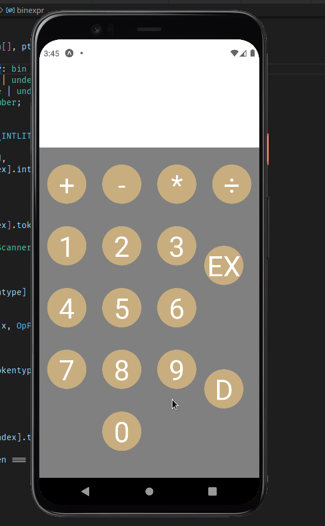

<p align="center"></p>

<h2 align="center"><b>YASC</b></h2>

<h4 align="center">A simple calculator with operator precedence, using Lexical Analysis and Pratt parsing.</h4>

<hr>

## GIF

[](./assets/calc_gif.gif)

## How to run
- Clone Repository
- run ``` yarn install ```
- run ``` yarn start ```

## Contribution
All and any contribution welcomed.